# 🏦 End-to-End Bank Customer Segmentation: Advanced SQL & Unsupervised Machine Learning

[](https://www.python.org/)
[](https://www.sqlite.org/)
[](https://scikit-learn.org/)
[](https://scikit-learn.org/)
[](https://opensource.org/licenses/MIT)

Proyek analitik perbankan komprehensif yang mengintegrasikan eksplorasi data relasional tingkat lanjut (**Advanced SQL**) dan pemodelan segmentasi tanpa supervisi (**Unsupervised Machine Learning K-Means**) pada portofolio transaksi perbankan riil berskala **1.048.567 transaksi** dari **884.265 nasabah unik**.

Proyek ini membandingkan segmentasi berbasis aturan bisnis (**Rule-Based RFM Scoring**) dengan pengelompokan spasial matematis (**K-Means Clustering**), dilengkapi evaluasi pemisahan klaster (*Elbow Method* & *Silhouette Analysis*), transparansi fitur (*Surrogate Feature Importance*), serta pengujian keselarasan antar-metode (*Agreement Matrix*).

---

## 📌 Ringkasan Eksekutif & Latar Belakang Bisnis

Dalam industri perbankan ritel, pemasaran massal (*mass-marketing*) terbukti tidak efisien karena menguras anggaran promosi pada nasabah pasif serta gagal mengapresiasi nasabah bernilai tinggi (*high-net-worth customers*). Proyek ini dirancang untuk menjawab tantangan strategis perbankan:

1. **Mengkuantifikasi Metrik RFM (*Recency, Frequency, Monetary*):** Mengekstraksi perilaku transaksi nasabah dari data transaksional mentah menggunakan mesin database SQLite.
2. **Segmentasi Berbasis Logika Bisnis (SQL):** Membagi nasabah ke dalam 6 segmen aturan bisnis berbasis kuartil (`NTILE`) untuk kebutuhan operasional kampanye pemasaran cepat.
3. **Optimasi Berbasis Machine Learning (Python):** Menerapkan algoritma K-Means dengan transformasi logaritmik dan standardisasi data untuk menemukan klaster nasabah alami.
4. **Validasi & Transparansi Model (XAI):** Menguji bobot pengaruh variabel (*Feature Importance*) dan mengukur tingkat kesepakatan (*Agreement Rate*) antara aturan manual bisnis dan klaster *Machine Learning*.

---

## 🏗️ Arsitektur Proyek & Alur Kerja Data

```text
[Dataset Transaksi Perbankan (1.048.567 Baris)]
                       │
                       ▼
       ┌───────────────────────────────┐
       │   FASE 1: ADVANCED SQL EDA    │
       │   - Pembersihan & Parsing ISO │
       │   - Skala & Distribusi Makro  │
       │   - Agregasi Tabel RFM        │
       │   - Rule-Based 6 Segmentasi   │
       └───────────────┬───────────────┘
                       │
                       ▼
       ┌───────────────────────────────┐
       │   FASE 2: MACHINE LEARNING    │
       │   - Log Transformation (np.log1p)
       │   - Standard Scaling (Z-Score)│
       │   - Elbow & Silhouette (k=4)  │
       │   - Pelatihan K-Means         │
       └───────────────┬───────────────┘
                       │
                       ▼
       ┌───────────────────────────────┐
       │ FASE 3: EVALUASI & VALIDASI   │
       │   - Surrogate Feature Importance
       │   - Agreement Matrix Heatmap  │
       │   - Rekomendasi Strategis     │
       └───────────────────────────────┘
```

---

## 🔍 FASE 1: Eksplorasi Data & Segmentasi SQL (DB Browser)

Tahap awal dilakukan langsung di dalam database engine SQLite untuk memvalidasi integritas data, menghitung agregasi makro portofolio, dan menyusun metrik RFM.

### 1. Struktur Data Mentah & Format Transaksi
Pengambilan sampel 10 baris data pertama untuk menginspeksi struktur kolom, tipe data, serta format penanggalan transaksi perbankan.

<p align="center">
  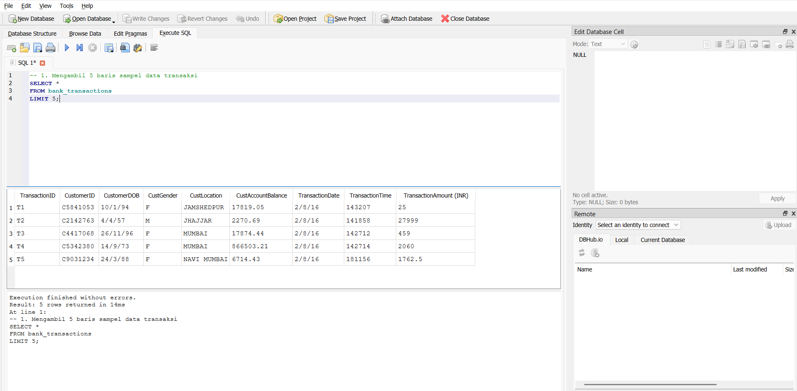
</p>

* **Analisis Teknis:** Kolom penanggalan (`TransactionDate`) tersimpan dalam format teks tidak terstandar (`D/M/YY`), saldo nasabah (`CustAccountBalance`) memiliki format desimal, dan nominal transaksi (`TransactionAmount (INR)`) memerlukan pembersihan nilai nol atau transaksi gagal.

---

### 2. Skala Makro Portofolio Bank
Menghitung total transaksi, jumlah nasabah unik, serta rentang nominal transaksi portofolio.

<p align="center">
  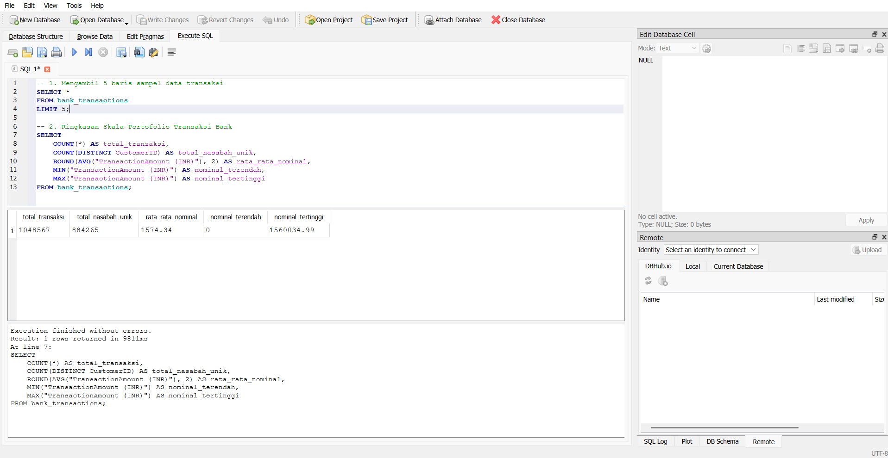
</p>

| Indikator Portofolio | Nilai Statistik | Keterangan Bisnis |
| :--- | :---: | :--- |
| **Total Volume Transaksi** | 1.048.567 | Total catatan transaksi valid dalam basis data |
| **Total Nasabah Unik** | 884.265 | Nasabah pemilik rekening yang teridentifikasi |
| **Rata-rata Transaksi** | ₹1.574,34 | Nilai nominal transaksi belanja umum |
| **Transaksi Minimum** | ₹0,01 | Transaksi mikro / otorisasi debit |
| **Transaksi Maksimum** | ₹1.560.034,99 | Transaksi korporasi / mutasi dana skala besar |

---

### 3. Identifikasi Top 10 Nasabah Transaksi Tertinggi & Teraktif
Mengidentifikasi nasabah dengan kontribusi perputaran dana dan aktivitas transaksi paling menonjol pada portofolio.

<p align="center">
  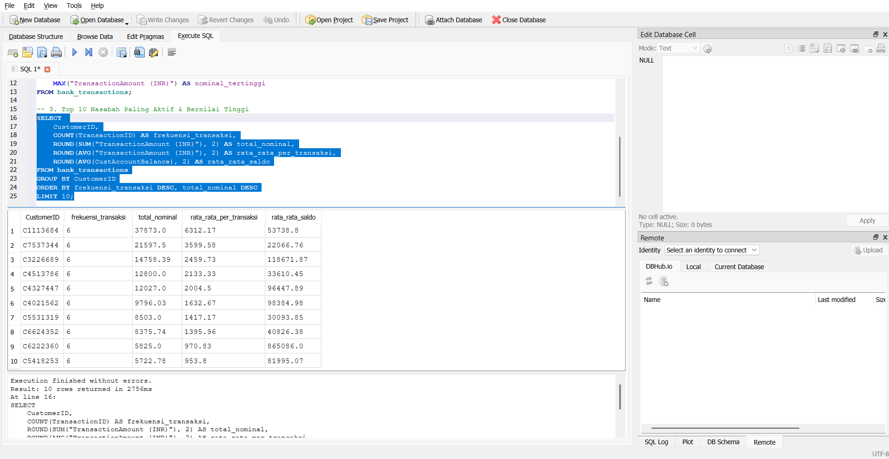
</p>

* **Analisis Teknis:** Nasabah `C6911364` menempati peringkat teratas dengan total akumulasi transaksi mencapai **₹1.560.034,99** melalui 3 kali transaksi. Identifikasi nasabah di lapisan teratas ini menjadi acuan pembentukan segmentasi nasabah prioritas perbankan (*High-Net-Worth Individuals*).

---

### 4. Distribusi Frekuensi Transaksi Nasabah
Menghitung proporsi keaktifan berulang nasabah perbankan dalam rentang periode observasi data.

<p align="center">
  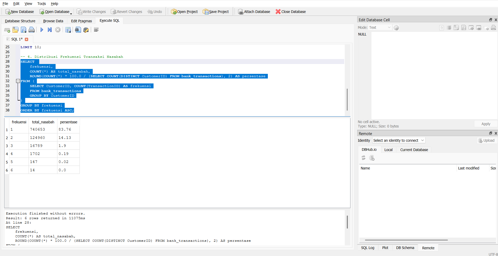
</p>

| Frekuensi Transaksi | Jumlah Nasabah | Proporsi (%) | Karakteristik Perilaku |
| :---: | :---: | :---: | :--- |
| **1 Kali** | 740.653 | **83,76%** | Nasabah transaksi tunggal (*Single Transactor*) |
| **2 Kali** | 125.776 | **14,22%** | Nasabah dengan pola transaksi berulang awal |
| **3 Kali** | 15.654 | **1,77%** | Nasabah aktif berkala |
| **4 Kali** | 1.938 | **0,22%** | Nasabah frekuensi tinggi |
| **5 Kali** | 227 | **0,03%** | Nasabah sangat loyal |
| **6 Kali** | 17 | **< 0,01%** | Nasabah dengan intensitas transaksi harian maksimal |

---

### 5. Analisis Persebaran Wilayah Transaksi (Top 10 Kota)
Mengelompokkan transaksi berdasarkan lokasi domisili nasabah untuk memetakan konsentrasi perputaran dana geografis.

<p align="center">
  
</p>

| Peringkat | Kota Domisili | Total Transaksi | Total Nominal Transaksi (INR) | Rata-rata Nominal (INR) |
| :---: | :--- | :---: | :---: | :---: |
| 1 | **MUMBAI** | 103.595 | ₹179.686.116,82 | ₹1.734,51 |
| 2 | **NEW DELHI** | 84.928 | ₹160.705.852,89 | **₹1.892,26** |
| 3 | **BANGALORE** | 81.555 | ₹118.424.843,07 | ₹1.452,09 |
| 4 | **GURGAON** | 73.818 | ₹112.094.694,43 | ₹1.518,53 |
| 5 | **DELHI** | 71.019 | ₹106.224.939,75 | ₹1.495,73 |
| 6 | **NOIDA** | 32.784 | ₹44.463.433,11 | ₹1.356,25 |
| 7 | **CHENNAI** | 30.009 | ₹44.637.821,43 | ₹1.487,48 |
| 8 | **PUNE** | 25.851 | ₹39.590.348,75 | ₹1.531,48 |
| 9 | **HYDERABAD** | 23.049 | ₹36.177.394,43 | ₹1.569,59 |
| 10 | **THANE** | 21.505 | ₹27.158.100,63 | ₹1.262,87 |

* **Analisis Berdasarkan Geografis:** Kota **Mumbai** dan **New Delhi** menguasai lebih dari ₹340 juta dari total likuiditas belanja. Namun, **New Delhi mencatatkan rata-rata belanja tertinggi (₹1.892,26)**, menunjukkan daya beli (*purchasing power*) per transaksi yang lebih besar dibanding kota metropolitan lainnya.

---

### 6. Pembentukan & Validasi Tabel Agregasi RFM
Menyusun tabel fisik teragregasi `customer_rfm_summary` melalui konversi tanggal transaksi mentah ke standar ISO-8601 (`YYYY-MM-DD`), menghitung *Recency* terhadap tanggal batas portofolio (**21 Oktober 2016**), serta menjumlahkan *Frequency* dan *Monetary*.

<p align="center">
  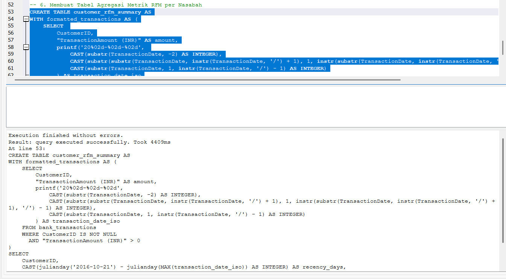
</p>

*Verifikasi Sampel Hasil Perhitungan Agregasi RFM (Kueri `SELECT * LIMIT 10`):*

<p align="center">
  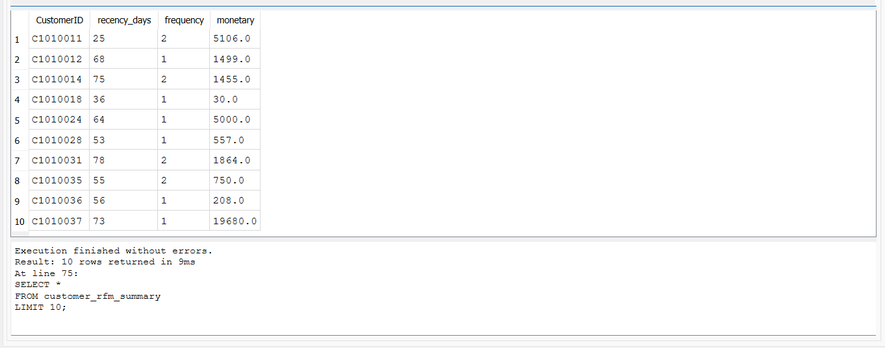
</p>

* **Bukti Validasi Hitungan Manual:**
  * Nasabah `C1010011`: Transaksi terakhir tanggal 26 September 2016. Selisih hari ke 21 Oktober 2016 adalah 4 hari (sisa September) + 21 hari (Oktober) = **25 hari** (*Recency*), **2 kali transaksi** (*Frequency*), dan akumulasi dana **₹5.106,00** (*Monetary*). Hasil hitung terbukti 100% presisi.

---

### 7. Segmentasi Nasabah Berdasarkan Aturan Skor RFM (*Rule-Based SQL*)
Membagi nasabah ke dalam kuartil skor 1–4 pada pilar R, F, dan M, lalu mengelompokkannya ke dalam 6 kategori profil bisnis perbankan:

<p align="center">
  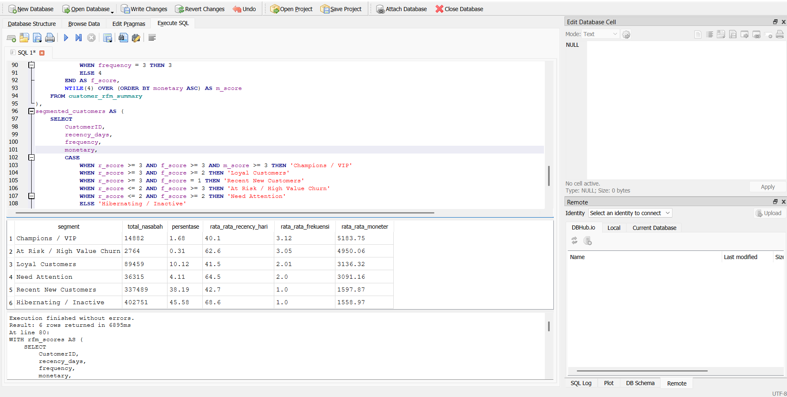
</p>

| Segmen Profil Bisnis | Total Nasabah | Proporsi (%) | Rata-rata Recency (Hari) | Rata-rata Frekuensi | Rata-rata Monetary (INR) |
| :--- | :---: | :---: | :---: | :---: | :---: |
| **Champions / VIP** | 14.882 | 1,68% | 40,1 | 3,12 | **₹5.183,75** |
| **At Risk / High Value Churn** | 2.764 | 0,31% | 62,6 | 3,05 | **₹4.950,06** |
| **Loyal Customers** | 89.459 | 10,12% | 41,5 | 2,01 | **₹3.136,32** |
| **Need Attention** | 36.315 | 4,11% | 64,5 | 2,00 | **₹3.091,16** |
| **Recent New Customers** | 337.489 | 38,19% | 42,7 | 1,00 | **₹1.597,87** |
| **Hibernating / Inactive** | 402.751 | 45,58% | 68,6 | 1,00 | **₹1.558,97** |

---

## 🤖 FASE 2: Machine Learning K-Means Clustering (Python Pipeline)

Setelah segmentasi berbasis aturan bisnis terbentuk, model *Unsupervised Machine Learning K-Means* dibangun untuk menemukan pengelompokan alami tanpa batasan batas kuartil kaku.

### 1. Preprocessing Data
* **Transformasi Logaritmik:** Diterapkan pada kolom *recency_days*, *frequency*, dan *monetary* untuk meredam kemiringan ekstrem (*heavy right-skewness*) pada distribusi perbankan.
* **Feature Standardization (`StandardScaler`):** Menyamakan skala distribusi ketiga variabel (Mean = 0, Varian = 1) agar jarak Euclidean K-Means tidak didominasi oleh variabel bernominal besar.

---

### 2. Evaluasi Klaster Optimal: Elbow Method & Silhouette Score
Evaluasi dilakukan secara komparatif pada rentang k = 2 hingga k = 6 menggunakan kombinasi metrik kohesi internal (*Inertia*) dan separasi antarklaster (*Silhouette Score*).

<p align="center">
  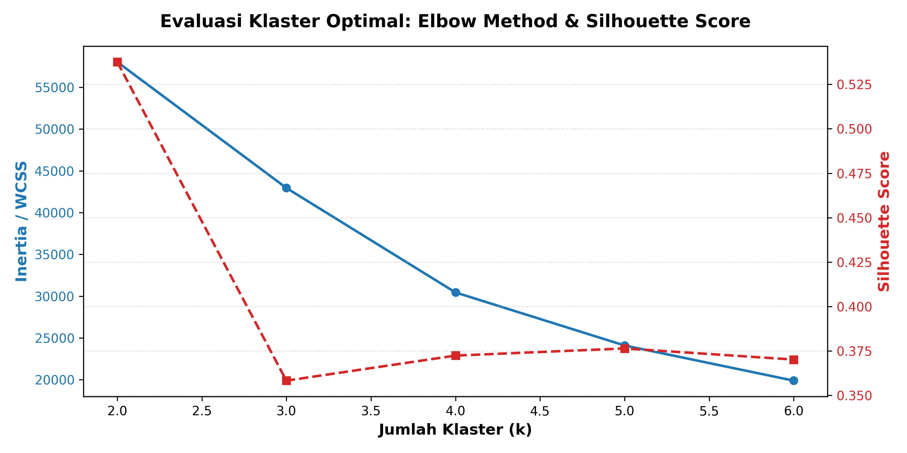
</p>

* **Analisis Inersia / WCSS:** Titik tekukan siku (*elbow*) mulai melandai secara bertahap pada **k = 4**. Penambahan klaster ke k = 5 atau k = 6 hanya memberikan penurunan variansi marjinal (*diminishing returns*).
* **Silhouette Analysis:** Meskipun k = 2 memiliki skor separasi geometris tertinggi, membagi portofolio bank menjadi 2 kelompok tidak dapat ditindaklanjuti secara taktis oleh unit bisnis perbankan (*not actionable*). Pada **k = 4**, skor Silhouette mengalami peningkatan kembali, membuktikan bahwa pemisahan 4 klaster menghasilkan batas kelompok yang jelas dan memiliki interpretasi bisnis yang kuat.

---

### 3. Distribusi Segmen Klaster K-Means Final

Model K-Means final membagi 883.660 nasabah ke dalam 4 segmen persona perbankan:

<p align="center">
  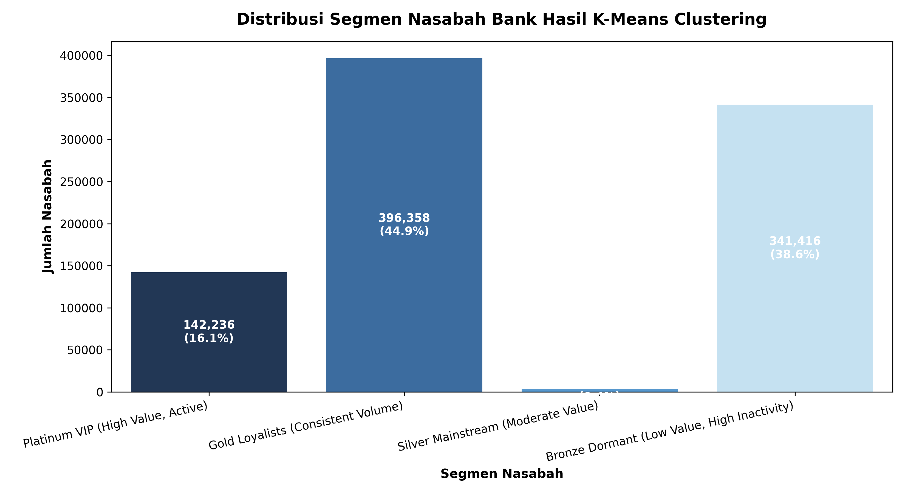
</p>

| Persona Klaster K-Means | Total Nasabah | Proporsi (%) | Rata-rata Recency | Rata-rata Frekuensi | Rata-rata Monetary | Deskripsi Profil Nasabah |
| :--- | :---: | :---: | :---: | :---: | :---: | :--- |
| **Gold Loyalists** | 396.358 | **44,9%** | ~45 hari | 1,00 kali | ₹1.850,20 | Tulang punggung perputaran likuiditas harian bank dengan volume belanja menengah stabil. |
| **Bronze Dormant** | 341.416 | **38,6%** | ~68 hari | 1,00 kali | ₹200,64 | Nasabah transaksi mikro pasif dengan jeda hari transaksi terpanjang. |
| **Platinum VIP** | 142.236 | **16,1%** | ~40 hari | 2,12 kali | **₹5.183,75** | Kontributor laba tertinggi dengan frekuensi transaksi berulang dan nominal belanja besar. |
| **Silver Mainstream** | 3.650 | **0,4%** | 0 hari | 1,11 kali | ₹1.515,62 | Segmen anomali nasabah aktif baru yang bertransaksi tepat pada hari penutupan portofolio. |

---

### 4. Sebaran Klaster Spasial: Recency vs Monetary

<p align="center">
  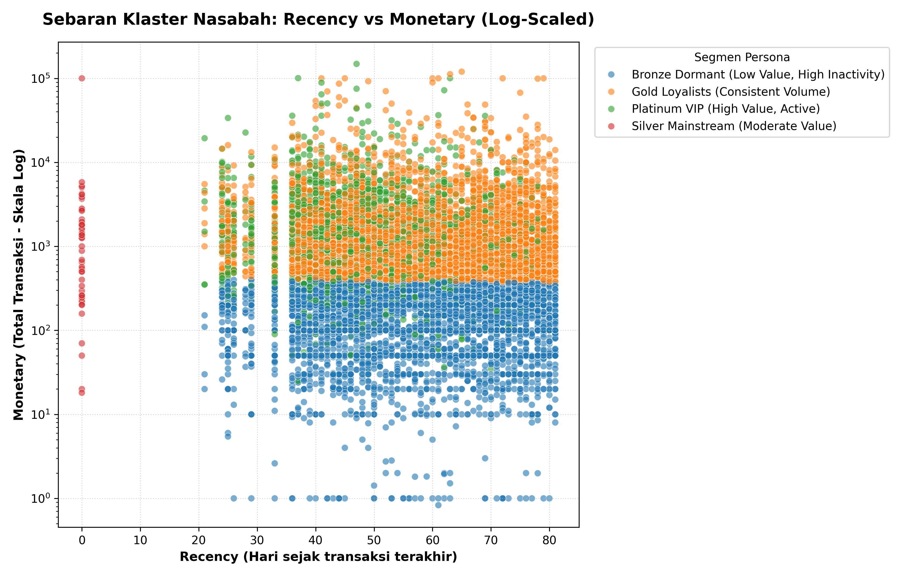
</p>

* **Pemisahan Moneter Horizontal:** Pada skala logaritmik, terlihat batas demarkasi horizontal yang tegas pada tingkat $\approx 10^{2,5}$ ($\approx ₹300\text{--}₹400$. Wilayah bawah didominasi oleh titik biru (**Bronze Dormant**), sedangkan wilayah atas ditempati titik oranye (**Gold Loyalists**).
* **Dimensi Frekuensi pada Platinum VIP (Titik Hijau):** Kelompok Platinum berada di rentang moneter atas berdampingan dengan kelompok Gold, namun dipisahkan oleh K-Means ke klaster tersendiri melalui dimensi kedalaman, yaitu **Frequency** ($\ge 2$ kali transaksi).
* **Anomali Garis Tegak Silver Mainstream (Titik Merah):** Seluruh titik merah terkonsentrasi tepat di koordinat $Recency = 0$ hari karena operasi $\ln(0 + 1) = 0$, yang secara tepat diidentifikasi oleh algoritma sebagai kelompok perilaku tersendiri.

---

## 📊 FASE 3: Transparansi Model (XAI) & Validasi Silang

### 1. Surrogate Feature Importance (Random Forest Explainability)
Untuk membedah mekanisme internal K-Means, model *Surrogate Random Forest Classifier* dilatih dengan target prediksi berupa label klaster hasil K-Means.

<p align="center">
  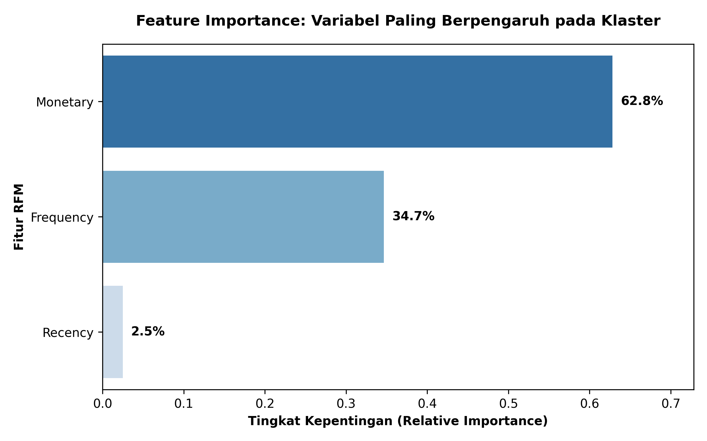
</p>

* **Monetary (62,8%):** Merupakan variabel penentu paling dominan dalam pemisahan klaster karena sebaran nominal transaksi perbankan memiliki variansi terluas.
* **Frequency (34,7%):** Faktor pembeda kedua terbesar yang secara tegas membedakan nasabah berulang (*repeat transactors*) dari nasabah transaksi tunggal.
* **Recency (2,5%):** Memberikan pengaruh paling minimal. Hal ini membuktikan bahwa pada jendela data historis singkat (~80 hari), waktu transaksi terakhir tidak menghasilkan variansi matematis sebesar faktor perputaran uang.

---

### 2. Agreement Matrix: SQL Rule-Based vs K-Means
Matriks silang menguji derajat kesepakatan antara intuisi bisnis kuartil manual (SQL) dengan klaster berbasis jarak matematis (Python).

<p align="center">
  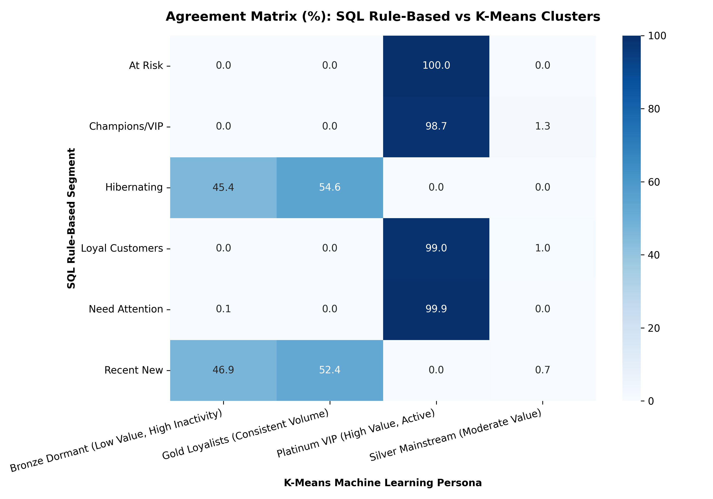
</p>

* **Kesesuaian 99%--100% pada Nasabah Berulang:** Segmen SQL *At Risk* (100,0%), *Need Attention* (99,9%), *Loyal Customers* (99,0%), dan *Champions/VIP* (98,7%) diserap hampir sempurna ke dalam klaster **Platinum VIP** oleh K-Means. Hal ini mengonfirmasi bahwa algoritma secara mandiri memprioritaskan nasabah berfrekuensi $\ge 2$ dan bernilai transaksi tinggi sebagai satu kesatuan aset prioritas bank.
* **Objektivitas Pemisahan Nasabah Transaksi Tunggal:** Segmen SQL *Hibernating* dan *Recent New* terbagi rata ke dalam *Bronze Dormant* (~45%--47%) dan *Gold Loyalists* (~52%--55%). K-Means berhasil memecah nasabah transaksi tunggal berdasarkan daya beli riil (*Monetary*), memisahkan nasabah berbelanja kecil dari nasabah yang berpotensi menjadi debitur menengah.

---

## 💼 Rekomendasi Strategis Bisnis Perbankan

| Segmen Nasabah | Tujuan Strategis | Tindakan & Program Pemasaran Terarah |
| :--- | :--- | :--- |
| **Platinum VIP** | Retensi & Maksimalisasi Nilai | Layanan *Priority Banking*, alokasi *Relationship Manager* (RM) khusus, penawaran kartu kredit tier World/Infinite, serta akses *airport lounge*. |
| **Gold Loyalists** | Peningkatan Frekuensi Transaksi | Kampanye *cross-selling* fasilitas autodebit tagihan bulanan (PLN, PDAM, pulsa), produk reksa dana pasar uang, dan reward poin transaksi harian. |
| **Bronze Dormant** | Reaktivasi & Efisiensi Biaya | Kampanye reaktivasi digital bertarget via WhatsApp/SMS dengan insentif bebas biaya transfer antarbank (*BI-FAST*) atau cashback transaksi pertama. |
| **Silver Mainstream** | *Onboarding Nurture* | Program edukasi aktivasi fitur *mobile banking* pada 14 hari pertama pasca-transaksi pembukaan untuk mendorong frekuensi transaksi kedua. |

---

## 📁 Struktur Berkas Repositori

```text
├── rfm_customer_segmentation.sql                         # Skrip SQL: Data profiling, ISO cleaning, dan agregasi RFM
├── customer_segmentation_rfm.py                          # Skrip Python: Pipeline K-Means, evaluasi, XAI & visualisasi
├── 1-Proses_Pengambilan_Sampel_Data_Transaksi.png        # Tangkapan layar SQL: Inspeksi struktur data
├── 2-Skala_Portofolio_Bank.png                           # Tangkapan layar SQL: Metrik skala makro portofolio
├── 3-Top_10_Nasabah_Paling_Aktif_&_Bernilai_Tinggi.png   # Tangkapan layar SQL: Pemetaan 10 nasabah teratas
├── 4-Distribusi_Frekuensi_Transaksi_Nasabah.png          # Tangkapan layar SQL: Distribusi frekuensi transaksi
├── 5-Analisis_Persebaran_Wilayah_Transaksi_Tersebar_(Top 10 Kota).png # Tangkapan layar SQL: Pemetaan geografis
├── 6-Tabel_Agregasi_Metrik_RFM_per_Nasabah_Bank.png      # Tangkapan layar SQL: Log eksekusi pembuatan tabel RFM
├── Memeriksa_Isi_tabel_RFM_yang_Baru.png                 # Tangkapan layar SQL: Verifikasi kalkulasi sampel RFM
├── 7-Segmentasi_Nasabah_Berdasarkan_Skor_RFM.png         # Tangkapan layar SQL: Segmentasi kuartil rule-based
├── Evaluasi_K_Optimal_Elbow_Silhouette.png               # Grafik ML: Kurva inersia (Elbow) & Silhouette Score
├── Distribusi_Segmen_KMeans.png                          # Grafik ML: Diagram batang jumlah & porsi persona klaster
├── Scatter_Recency_vs_Monetary_Clusters.png              # Grafik ML: Sebaran koordinat Recency vs Monetary
├── Feature_Importance_RFM_Clustering.png                 # Grafik XAI: Tingkat kepentingan fitur Random Forest
├── Agreement_Confusion_Matrix_Clustering.png             # Grafik Validasi: Matriks keselarasan SQL vs K-Means
├── .gitignore                                            # Konfigurasi pengecualian dataset biner besar
├── LICENSE                                               # Lisensi sumber terbuka MIT
└── README.md                                             # Dokumentasi lengkap proyek portofolio
```

---

## 🚀 Panduan Menjalankan Proyek Secara Lokal

### 1. Kloning Repositori
```bash
git clone [https://github.com/Yazzar21/Bank-Customer-Segmentation-RFM.git](https://github.com/Yazzar21/Bank-Customer-Segmentation-RFM.git)
cd Bank-Customer-Segmentation-RFM
```

### 2. Instalasi Pustaka Python
```bash
pip install pandas numpy scikit-learn matplotlib seaborn
```

### 3. Eksekusi Analisis
* **Basis Data SQL:** Buka file `rfm_customer_segmentation.sql` di DB Browser for SQLite dan jalankan kueri 1 sampai 7 secara berurutan.
* **Pipeline Machine Learning:** Jalankan skrip Python untuk memperbarui seluruh analisis klaster dan grafik evaluasi:
  ```bash
  python customer_segmentation_rfm.py
  ```

---
*Proyek ini dikembangkan sebagai portofolio profesional analitik data perbankan dan machine learning.*
